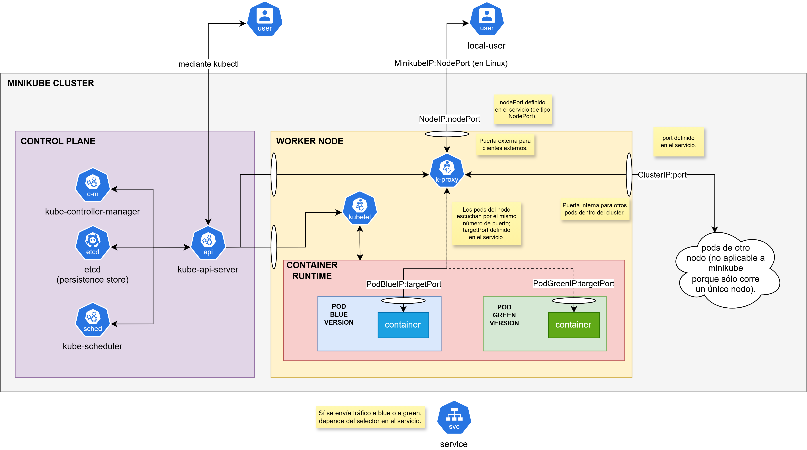

# Entregable 1 - Aplicación en Kubernetes

## Consigna

- En grupos de 2 o 3, pensar en un problema o proyecto a resolver durante el curso.
- Debe desarrollarse una aplicación que será contenerizada y desplegada en Kubernetes.
- Una segunda versión con algún cambio mínimo debe ser desarrollada, y se debe alternar entre despliegues utilizando la estrategia blue/green.

## Condiciones

- Stack de tecnologías libre.
- Alcance acorde al curso.
- Utilización de Dockerfile obligatoria.
- Despliegue en minikube o un clúster a elección.
- Fecha de entrega: semana 5 de clase.

## Evaluación

- Funcionalidad – 30%
- Calidad técnica – 25%
- Uso correcto de k8s – 20%
- Documentación y reproducibilidad – 15%
- Trabajo en equipo – 10%

# Documentación

## Funcionalidad

### Descripción de la Aplicación

La aplicación es una API (más precisamente, API + backend) simple en Python que permite validar si un número es una cédula de identidad uruguaya.

El servicio no tiene estado: no utiliza volúmenes, ni base de datos, ni estado en memoria.

> **_Nota_** Algoritmo para calcular el dígito verificador de la cédula de identidad uruguaya: https://www.youtube.com/watch?v=JTGrNyKa1lI

### Endpoints v1.0.0

- `GET /health` : Retorna estado de la API (title, version y status).

    Body Response:
    ```json
    {
        "title": string,
        "version": string,
        "status": string
    }
    ```

- `GET /ci/{number:string}` : Toma los dígitos de la cadena (number) y valida si el número es una cédula de identidad uruguaya.

    Body Response:
    ```json
    {
        "input": string,                    
        "normalized_ci": string,            # Forma canónica de la cédula (xxxxxxxx).
        "valid": bool,                      # Indica si la cédula es válida.
        "expected_check_digit": integer,    # Dígito verificador esperado dada la base.
        "message": string,                  # Mensaje.
        "api_version": string               # Versión de la API.
    }
    ```

### Endpoints v2.0.0

Los mismos endpoints que la versión v1.0.0, pero agregando un nuevo campo al Body Response del endpoint `GET /ci/{number:string}`:

Body Response:
```json
{
    "input": string,
    "normalized_ci": string,            # Forma canónica de la cédula (xxxxxxxx).
    "formatted_ci": string,             # NUEVO v2.0.0. Forma de presentación de cédula (xxx.xxx-x o x.xxx.xxx-x).
    "valid": bool,                      # Indica si la cédula es válida.
    "expected_check_digit": integer,    # Dígito verificador esperado dada la base.
    "message": string,                  # Mensaje.
    "api_version": string               # Versión de la API.
}
```

## Stack Tecnológico

La aplicación utiliza:

- [FastAPI](https://fastapi.tiangolo.com/):

    FastAPI es un framework web de alto rendimiento para crear APIs de servicios basados en HTTP en Python 3.8+. Utiliza Pydantic y sugerencias de tipo para validar, serializar y deserializar datos. FastAPI también genera automáticamente documentación OpenAPI para las APIs creadas con él.

    > **_Nota_** [Pydantic](https://pydantic.dev/docs/validation/latest/get-started/) es una librería de Python que sirve para validar y transformar datos de forma automática.

    > **_Nota_** [OpenAPI](https://www.openapis.org/) es un formato estándar y abierto para describir API REST. Permite definir rutas, parámetros, métodos HTTP y respuestas en archivos legibles por humanos y máquinas usando YAML o JSON, sin importar el lenguaje de programación.

- [Uvicorn](https://uvicorn.dev/):

    Uvicorn es una implementación de servidor web ASGI (Asynchronous Server Gateway Interface) para Python.

    Hasta hace poco, Python carecía de una interfaz de servidor/aplicación de bajo nivel para frameworks asíncronos. La especificación ASGI cubre esta carencia y nos permite comenzar a desarrollar un conjunto común de herramientas utilizables en todos los frameworks asíncronos.

    > **_Nota_** [ASGI (Asynchronous Server Gateway Interface)](https://asgi.readthedocs.io/en/latest/) está diseñado para proporcionar una interfaz estándar entre servidores web, frameworks y aplicaciones Python con capacidad síncrona y asíncrona.

La aplicación es desplegada con:

- [Docker](https://www.docker.com/)

    Docker es una plataforma de código abierto que utiliza la tecnología de contenedores para crear, probar e implementar aplicaciones rápidamente. Empaqueta el software en unidades ligeras e independientes llamadas contenedores, que incluyen todo lo necesario para que la aplicación funcione, como código, entorno de ejecución, herramientas del sistema y bibliotecas. Esto garantiza que la aplicación se comporte de forma idéntica en diferentes entornos, eliminando el clásico problema de "en mi máquina funciona".

- [Kubernetes (k8s)](https://kubernetes.io/es/)

    Kubernetes es un sistema que permite automatizar, escalar y administrar aplicaciones contenerizadas. Junta una o más computadoras, ya sean máquinas virtuales o hardware "bare metal", en un clúster que puede correr workloads en contenedores.

- [Minikube](https://minikube.sigs.k8s.io/docs/)
    
    Minikube es una herramienta de código abierto que permite ejecutar un clúster de Kubernetes de forma local en tu propia computadora.

## Estrategia de Deployment Blue/Green

La [estrategia de despliegue blue/green](https://www.ibm.com/think/topics/blue-green-deployment) es un método para desplegar software nuevo que usa dos entornos de producción idénticos (blue y green) para evitar interrupciones en el servicio y permitir rollbacks rápidos.

### ¿Cómo funciona?

- Entorno blue: Actúa como la versión actual en vivo que maneja todo el tráfico de los usuarios activos.
- Entorno green: Contiene la nueva versión actualizada de la aplicación de la que se hicieron pruebas y la verificación final.
- Conmutador de tráfico: Un enrutador, balanceador de carga o conmutador DNS dirige el tráfico de los usuarios desde el entorno blue al entorno green una vez que se aprueba la versión de green.
- Rollback: Si el entorno green tiene errores críticos, el tráfico regresa instantáneamente al entorno blue.
- En espera: Después de una transición exitosa, el antiguo entorno blue permanece en espera como respaldo o se actualiza durante el siguiente ciclo de lanzamiento.

### Aplicación a la Consigna

Entornos:

- Blue: `ci-validator-api v1.0.0`
- Green: `ci-validator-api v2.0.0`

k8s no tiene blue/green nativo, sólo se puede lograr manipulando el selector de un Service.

> **_Nota_** En este caso, el rollback se hace de forma manual y no automática.

Un Service es un recurso API de Kubernetes que define un punto final de red estable (una dirección IP permanente y un nombre DNS) para conectar un grupo específico de pods.

Debido a que los pods de Kubernetes son efímeros (lo que significa que con frecuencia se destruyen, recrean, escalan y se les asignan direcciones IP nuevas e impredecibles), no se puede confiar en la IP de pods individuales para la creación de redes. Un Service declara el conjunto de pods y les asigna una identidad de red estable (en este caso, MinikubeIP:nodePort para tráfico externo al clúster y ClusterIP:port para tráfico interno del clúster), como se puede ver en el siguiente diagrama:



> **_Nota_** Un cliente externo envía tráfico que entra al nodo y que luego este se encarga de enviar a alguno de sus pods según el selector del Service.

## Comandos para Desplegar y Utilizar la Aplicación

Los siguientes comandos fueron ejecutados en PowerShell (>v6.0):

```bash
cd ci-validator-api

# 1. Build de imágenes Docker.
docker build -f Dockerfile -t ci-validator-api:1.0.0 ./v1.0.0
docker build -f Dockerfile -t ci-validator-api:2.0.0 ./v2.0.0

# 2. Iniciar Minikube.
minikube start --driver=docker

# 3. Transferir las imágenes locales Docker a Minikube.
minikube image load ci-validator-api:1.0.0
minikube image load ci-validator-api:2.0.0

# Ver imágenes en minikube.
minikube image ls

# 4. Crear pod con un contenedor con la versión blue (1.0.0) y otro pod con la versión green (2.0.0).
kubectl apply -f deployment-blue.yaml
kubectl apply -f deployment-green.yaml

# Ver status de los deployments.
kubectl rollout status deployment/ci-validator-api-blue
kubectl rollout status deployment/ci-validator-api-green

# Ver pods.
kubectl get pods

# Verificar que el pod blue corre la imagen v1.0.0 y que el pod green corre la imagen v2.0.0.
kubectl get pods -l app=ci-validator-api,version=blue -o jsonpath='{.items[0].spec.containers[0].image}'
kubectl get pods -l app=ci-validator-api,version=green -o jsonpath='{.items[0].spec.containers[0].image}'

# 5. Crear servicio para redirigir tráfico a blue y luego a green (inicialmente se redirige a blue).
kubectl apply -f service.yaml

# Verificar el selector del service (debería apuntar a blue).
kubectl get service ci-validator-api -o jsonpath='{.spec.selector.version}'

# 6. Abrir dos terminales para ver los logs de ambos pods.
kubectl logs -f -l version=blue --prefix --max-log-requests=10
kubectl logs -f -l version=green --prefix --max-log-requests=10

# 7. En otra terminal, levantar el túnel para conectarse al pod.
minikube service ci-validator-api --url
# Esto dará la URL para conectarse al pod, que es algo como http://localhost:X, X siendo un número de puerto cualquiera.

# 8. Enviar tráfico y revisar los logs de las otras terminales (deberían llegar peticiones a blue).
http://localhost:X/docs

# 9. En otra terminal, cambiar el selector del service de blue a green.
kubectl patch service ci-validator-api -p '{"spec":{"selector":{"version":"green"}}}'

# Verificar el selector del service (debería apuntar a green).
kubectl get service ci-validator-api -o jsonpath='{.spec.selector.version}'

# 10. Enviar el tráfico de nuevo y ver los logs en la terminal de blue y green (ahora deberían llegar peticiones a green).
http://localhost:X/docs

# 11. Rollback.
kubectl patch service ci-validator-api -p '{"spec":{"selector":{"version":"blue"}}}'

# Verificar el selector del service (debería apuntar a blue).
kubectl get service ci-validator-api -o jsonpath='{.spec.selector.version}'

# 12. Enviar el tráfico de nuevo y ver los logs en la terminal de blue y green (ahora deberían llegar peticiones a blue).
http://localhost:X/docs

minikube stop
```